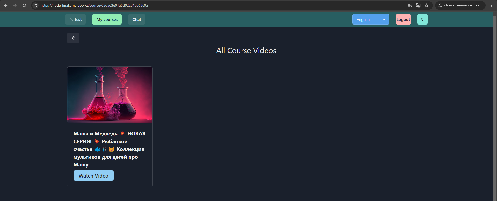

## App

- https://node-final.ems-app.kz/

Admin:          (username: admin, password: admin)

Test user:      (username: test, password: test)

**Users can be created only from admin dashboard**
**After making some actions in Admin page, please refresh the page if result of action is not visible**

## Description

The project is for managing of online course, with students and course content.
Its deployed on my own host. (https://node-final.ems-app.kz/)

In project I used ChatGPT AI, feature for online consulting about math problems and etc (but actually my api key expired, it was not free, free period already expired, I think you'll check it out).
https://github.com/duisenbekernur/chemistry-server/blob/main/src/controllers/OpenAiController.js

ytdl-core - API for parsing youtube video datas
https://github.com/duisenbekernur/chemistry-server/blob/main/src/controllers/VideoController.js

### Login page

### Admin users page

### Admin courses page

### Questions of video page

### Courses page

### Course videos page

### Video page with questions

### Passed questions history of the USER
